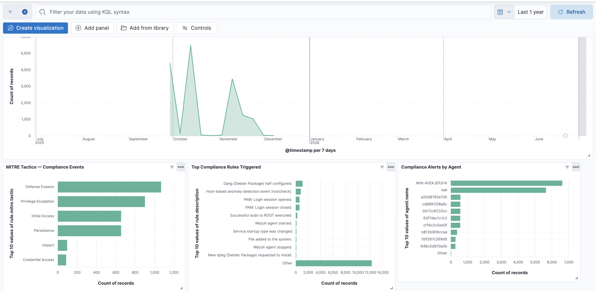

# TIGARSEC SOCaaS — Autonomous SOC for SMEs

**An open-source, autonomous Security Operations Centre built for small and medium enterprises who need continuous monitoring without an enterprise budget or a 24/7 analyst team.**

> A physical person does not need to watch a dashboard all day. The platform detects, triages, enriches, and escalates — a human only gets pulled in when something genuinely matters.


---

## What this is

Most SMEs fall into one of two traps: they buy a firewall and call it security, or they outsource to a managed provider with zero visibility into what's actually happening on their own systems. Neither gives them a real audit trail, and in regulated sectors like fintech, that absence is a compliance failure waiting to happen.

This project is a fully working alternative — a SOC platform that runs autonomously, triages every alert by severity, enriches critical events with threat intelligence, opens a case automatically, and only notifies a human for things that genuinely require action.

It is built entirely on open-source tooling and is designed to be deployable by a single person on a laptop, a VM, or a small dedicated server.

---

## Architecture

```
[Agents: Windows / Linux / Sysmon]
              ↓
       [Wazuh Manager]
   (detection, rules, FIM, vuln scanning)
              ↓
   ┌──────────┴──────────┐
   ↓                      ↓
[Filebeat]          [Wazuh Integration]
   ↓                      ↓
[Elasticsearch]      [n8n webhook]
   ↓                      ↓
[Kibana]            [Severity triage]
                    Level ≥ 12 → AbuseIPDB enrichment
                          ↓
                    [TheHive case created]
                          ↓
                    [WhatsApp / Slack / Email]
```

**Detection layer** — Wazuh Manager applies decoders and rules to every agent event, flags file integrity violations, runs vulnerability scans against NVD/vendor feeds, and tags alerts with PCI-DSS, GDPR, HIPAA, and MITRE ATT&CK metadata out of the box.

**Storage and visualisation** — Filebeat ships every alert into Elasticsearch. Kibana provides four purpose-built dashboards: Security Overview, Authentication, PCI-DSS Compliance, and Agent Health.

**Automation layer** — every alert at severity level 7+ is forwarded via webhook to n8n, an open-source workflow engine. Alerts are triaged by severity, critical events (level 12+) are enriched with AbuseIPDB threat intelligence, and a case is automatically opened in TheHive.

**Notification layer** — critical alerts are pushed to WhatsApp with full context (rule, affected host, source IP, AbuseIPDB confidence score, country, ISP) so an analyst can make a decision without opening a dashboard first.

---

## Stack

| Component | Role |
|---|---|
| [Wazuh](https://wazuh.com) | Host-based detection, FIM, vulnerability scanning |
| [Elasticsearch](https://www.elastic.co) | Log storage and indexing |
| [Kibana](https://www.elastic.co/kibana) | Dashboards and visualisation |
| [n8n](https://n8n.io) | SOAR — alert triage, enrichment, automation |
| [TheHive](https://strangebee.com/thehive) | Case management and audit trail |
| [AbuseIPDB](https://www.abuseipdb.com) | IP reputation enrichment |
| Docker / Docker Compose | Full containerised deployment |

---

## What it detects

Wazuh ships with rules covering SSH, web servers, databases, Windows security events, cloud platforms, and dozens of other sources. On top of that, this project adds a custom rule layer designed for multi-sector SOC delivery:

- `local_rules.xml` — base rules applied to every client (brute force escalation, privilege escalation, critical file integrity, CVE severity elevation)
- `tigarsec-fintech-rules.xml` — PCI-DSS mapped rules (failed sudo, after-hours access, SQL injection, web scanner detection, credential stuffing indicators)
- `tigarsec-healthcare-rules.xml` / `tigarsec-legal-rules.xml` — sector-specific placeholders, populated per client via Wazuh agent groups

This structure means a single Wazuh manager can serve multiple clients across different regulated sectors without rules bleeding between them.

---

## Dashboards

| Dashboard | Purpose |
|---|---|
| Security Overview | Alert volume, severity distribution, top triggered rules, top source IPs |
| Authentication | Failed login trends, most targeted users, failures by agent |
| PCI-DSS Compliance | Controls triggered, MITRE ATT&CK tactic breakdown, compliance trend over time |
| Agent Health | Active agent count, alert volume per agent, last-seen timestamps |



---

## Quick Start

### Prerequisites
- Docker Desktop
- 8GB+ RAM available to Docker
- A free [AbuseIPDB](https://www.abuseipdb.com/register) API key

### 1. Clone and configure

```bash
git clone https://github.com/NICANDIAS/SOCaaS_for_SMEs.git
cd SOCaaS_for_SMEs
```

### 2. Bring up the stack

```bash
docker compose up -d
```

This starts Elasticsearch, Kibana, Wazuh Manager, Filebeat, n8n, TheHive, and Cassandra.

### 3. Import the n8n workflow

1. Open `http://localhost:5678`
2. Import `n8n-workflows/wazuh-triage-workflow.json`
3. Add your AbuseIPDB API key and notification credentials to the relevant nodes
4. Publish the workflow

### 4. Import the Kibana dashboards

1. Open `http://localhost:5601`
2. Go to **Stack Management → Saved Objects → Import**
3. Import `kibana-dashboards/tigarsec-dashboards.ndjson`

### 5. Connect the webhook

Update `ossec.conf`'s integration block to point at your n8n production webhook URL, then restart Wazuh:

```bash
docker exec <wazuh-manager-container> /var/ossec/bin/wazuh-control restart
```

### 6. Install an agent

See [docs/04-Agent-Deployment.md](docs/04-Agent-Deployment.md) for Windows, Linux, and macOS install commands.

---

## Roadmap

- [x] Wazuh + Elasticsearch + Kibana detection pipeline
- [x] n8n SOAR integration with severity-based triage
- [x] AbuseIPDB threat intelligence enrichment
- [x] TheHive case management automation
- [x] WhatsApp critical and medium alert notifications
- [x] Multi-sector rule architecture (fintech rules live, healthcare/legal scaffolded)
- [x] Four production Kibana dashboards
- [ ] Slack and email notification channels
- [ ] Dashboard drill-down to raw event investigation
- [ ] Active response — automatic IP blocking for confirmed threats
- [ ] Suricata network IDS integration
- [ ] WireGuard VPN for secure agent-to-manager communication
- [ ] Multi-tenant agent group isolation for managed service delivery

---

## Documentation

Detailed architecture decisions, dashboard usage guides, and deployment notes live in [`docs/`](docs/).

---

## Why this exists

This project started as a PhD researcher's home lab and grew into a functioning SOC-as-a-Service platform. It exists to prove that meaningful, audit-ready security monitoring doesn't require an enterprise budget — just the right open-source tools, wired together with intent.

If you're an SME, an MSP looking to add SOC capability, or a security professional evaluating the approach, feel free to open an issue or get in touch.

---

## License

MIT — see [LICENSE](LICENSE).
