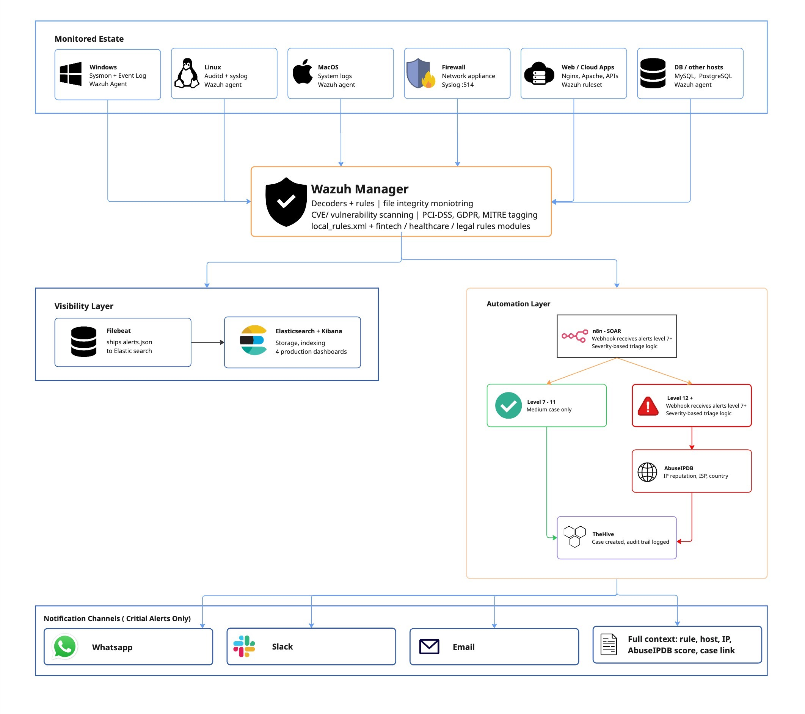

# Architecture

## Overview

TIGARSEC SOCaaS is a fully containerised, autonomous security monitoring platform built on open-source tooling. It is designed to be deployed by a single operator and run without continuous human oversight — alerts are triaged automatically, cases are created automatically, and humans are only notified when something genuinely requires action.

---

## Stack Components

| Component | Role | Port |
|-----------|------|------|
| Wazuh Manager | Detection engine, rules, FIM, vulnerability scanning | 1514, 1515, 55000 |
| Elasticsearch | Log storage and indexing | 9200 (internal only) |
| Kibana | Dashboards and visualisation | via Nginx /kibana |
| Filebeat | Ships Wazuh alerts into Elasticsearch | internal |
| n8n | SOAR — triage, enrichment, automation | via Nginx /n8n |
| TheHive | Case management and audit trail | via Nginx :9001 |
| Nginx | Reverse proxy — unified access point | 8080, 9001 |
| Cassandra | TheHive database backend | internal |

---

## Data Flow

### Detection pipeline

```
[Endpoint agents]
       ↓  (Wazuh protocol, port 1514)
[Wazuh Manager]
  applies decoders and rules
  tags with PCI-DSS, GDPR, HIPAA, MITRE ATT&CK
  runs FIM and vulnerability scans
       ↓
[Filebeat]
  ships alerts.json to Elasticsearch
       ↓
[Elasticsearch]
  stores and indexes all alert data
       ↓
[Kibana]
  4 production dashboards:
  - Security Overview
  - Authentication
  - PCI-DSS Compliance
  - Agent Health
```

### Automation pipeline

```
[Wazuh Manager]
  forwards alerts level 7+ via webhook
       ↓
[n8n SOAR]
  severity triage:
    level 7-11 (medium) → TheHive case only
    level 12+  (critical) → AbuseIPDB enrichment → TheHive case + notifications
       ↓
[AbuseIPDB] (critical only)
  IP reputation, abuse confidence score, country, ISP
       ↓
[TheHive]
  case created with full context and enrichment data
       ↓
[WhatsApp + Slack + Email]
  critical alerts only — analyst notified with full context
```

---

## Access Architecture

All services are accessed through a single Nginx reverse proxy rather than directly via ports. This provides a unified entry point and forms the foundation for future SSL termination and access control.

```
http://soc.local:8080/kibana/   → Kibana
http://soc.local:8080/n8n/      → n8n workflow engine
http://soc.local:9001/          → TheHive case management
```

In production, replace `soc.local` with your real subdomain (e.g. `soc.tigarsec.com`). This requires only a DNS change and SSL certificate — no config restructuring.

---

## Multi-Tenant Isolation

The platform supports multiple clients on a single deployment through three isolation layers:

**Wazuh agent groups** — each client's endpoints are assigned to a dedicated group (`client-alpha`, `client-beta`). Rules and configuration can be targeted per group.

**Kibana Spaces** — each client gets a dedicated Space containing their own copy of the four dashboards, filtered to show only their agents' data. Analysts assigned to a Space cannot see any other Space.

**TheHive organisations** — each client has a dedicated organisation. Cases, evidence, and analyst activity are contained within that organisation.

---

## Detection Rule Architecture

Custom rules follow a multi-sector structure, allowing a single Wazuh manager to serve clients across different regulated industries:

```
local_rules.xml                   Base rules — all clients (IDs 100001-100099)
tigarsec-fintech-rules.xml        PCI-DSS mapped rules (IDs 100100-100199)
tigarsec-healthcare-rules.xml     HIPAA mapped rules (IDs 100200-100299) — placeholder
tigarsec-legal-rules.xml          SRA/ICO mapped rules (IDs 100300-100399) — placeholder
```

All four files are mounted into the Wazuh manager container and loaded on startup. Adding rules for a new sector requires only populating the relevant placeholder file and restarting the Wazuh analysis daemon.

---

## Deployment Requirements

| Resource | Minimum | Recommended |
|----------|---------|-------------|
| RAM | 8GB available to Docker | 16GB |
| CPU | 4 cores | 8 cores |
| Disk | 50GB | 200GB (log retention) |
| OS | macOS, Linux, Windows (Docker Desktop) | Ubuntu 22.04 LTS |
| Docker | 24.0+ | Latest |

---

## Security Posture

The current deployment is configured for homelab and internal use. Before exposing to the internet or onboarding real clients, the following hardening steps should be completed:

- [ ] Enable SSL/TLS on Nginx (Let's Encrypt via Certbot)
- [ ] Remove direct port exposures — only Nginx ports (8080, 9001) and Wazuh agent ports (1514, 1515) should be accessible
- [ ] Configure Elasticsearch Document Level Security (DLS) for analyst data isolation
- [ ] Deploy WireGuard VPN for agent-to-manager communication
- [ ] Restrict Wazuh API (port 55000) to localhost only

---

## Architecture Diagram



*Generated diagram showing the full detection, automation, and notification pipeline.*
