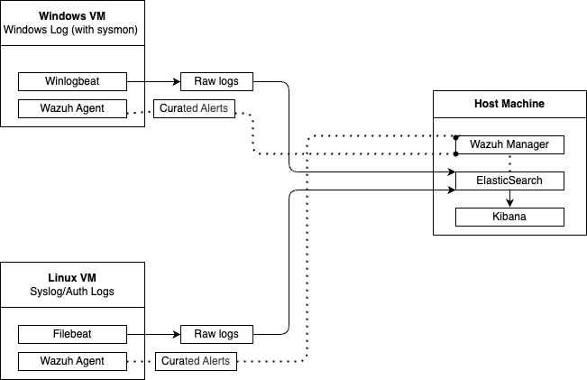

# Architecture

## Current Setup

### Host Machine (macOS)
Runs the core SOCaaS components:
- **Elasticsearch** – stores and aggregates logs from multiple sources.
- **Kibana** – visualizes raw logs and curated alerts for analysis.
- **Wazuh Manager** – receives data from agents, applies decoders/rules, and sends only suspicious alerts to Elasticsearch. It also adds:
  - Compliance check
  - File integrity monitoring (FIM)
  - Configuration security assessment (CSA)
  - Endpoint detection and response (EDR)
  - Incident analysis

### Windows VM
- **Data sources**: Windows Event Logs (with Sysmon enabled).
- **Winlogbeat**: ships raw logs directly to Elasticsearch.
- **Wazuh Agent**: sends events to Wazuh Manager for analysis, which then forwards only curated/suspicious alerts to Elasticsearch.

### Linux VM
- **Data sources**: Syslog and authentication logs.
- **Filebeat**: ships raw logs directly to Elasticsearch.
- **Wazuh Agent**: sends host-based telemetry to Wazuh Manager for analysis, which then forwards only curated/suspicious alerts to Elasticsearch.

## Data Flow
1. **Raw logs**
   - Windows -> Winlogbeat -> Elasticsearch
   - Linux -> Filebeat -> Elasticsearch
2. **Curated alerts**
   - Windows & Linux -> Wazuh Agent -> Wazuh Manager -> Elasticsearch
3. **Visualization**
   - All data (raw + curated) -> Kibana

This dual-pipeline design (raw + curated) provides **full visibility** while reducing **alert fatigue**.

## Next Planned Addition
- **Suricata IDS/IPS**:  
  Network traffic -> Suricata (eve.json) -> Filebeat Suricata module -> Elasticsearch.  
  This will add **network-level detection** and enable correlation across host + network + alert data.

## Diagram

