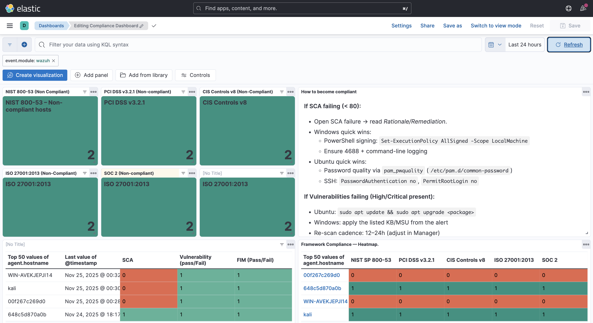

## 1. Security KPI Dashboard

**Purpose**  
Provides a high-level overview of the lab’s overall security posture. It highlights total alerts, high/critical alerts, unique hosts generating alerts, authentication outcomes, and basic coverage metrics.

**Primary audience**  
SOC Lead / SME Owner who needs a quick daily snapshot of risk and operational health rather than raw event logs.

**Key questions it answers**
- Are we under attack?
- Are things getting worse compared to yesterday?
- What has changed in the last 24 hours?
- How quickly are alerts being acknowledged or triaged?

**Data sources**
- **Winlogbeat** (Windows Security & Sysmon) — `ds-winlogbeat-*`
- **Filebeat** (Linux system/auth + Wazuh forwarded alerts) — `ds-filebeat-*`

**Main visualizations (panels)**

1. **Alerts Over Time (rule.level ≥ 7)**  
   Shows the volume and severity of alerts over time.  
   *How to read:* sudden spikes may indicate bursts of suspicious activity or misconfigurations.  
   *Action:* investigate time windows with unusual increases, correlate with host activity.

2. **Critical Alerts (rule.level ≥ 10)**  
   Focuses on the most severe events.  
   *How to read:* one critical alert may matter more than 100 low-severity ones.  
   *Action:* treat red spikes as immediate triage tasks.

3. **Unique Hosts Generating Alerts**  
   Identifies which hosts are producing alerts and how frequently.  
   *How to read:* a single noisy host may indicate compromise, misconfiguration, or an aggressive application.  
   *Action:* pivot into host-level telemetry and Wazuh rules affecting that host.

4. **Authentication Outcomes (Success vs Failure)**  
   Tracks login behavior across Windows/Linux systems.  
   *How to read:* elevated failed logins suggest brute-force attempts or password spraying.  
   *Action:* check SSH/Winlogon logs, correlate with source IP and Wazuh alerts.

5. **EDR Coverage Overview**  
   Shows which hosts have required agents (Wazuh, Beats, Sysmon) and whether logs are arriving as expected.  
   *How to read:* missing hosts indicate coverage gaps.  
   *Action:* verify agent installation or network connectivity.

**Example day / observation**
- On **2025-10-02**, a spike in Wazuh alerts came from `WIN-AVEKJEPJI4` immediately after Sysmon installation.  
- Most alerts were low/medium severity, indicating that tuning and noise reduction are still needed before a production-like setup.

**Limitations / next improvements**
- Suricata IDS/IPS data not yet integrated.  
- Limited user-level aggregation — dashboards currently focus on hosts rather than business roles.  
- No correlation panels yet (e.g., Wazuh alerts + raw logs + network events).

## 2. Compliance Dashboard

### Purpose  
Provides a consolidated view of endpoint compliance across the environment, including Security Configuration Assessment (SCA), Vulnerability status, and File Integrity Monitoring (FIM).  
This dashboard highlights which hosts fail key compliance frameworks and what actions are required to restore compliance.

### Primary Audience  
SOC leads, SME owners, GRC teams, auditors, or anyone needing a quick compliance snapshot without digging into raw event logs.

### Key Questions This Dashboard Answers
- Which hosts are **non-compliant** with major frameworks?
- How many vulnerabilities exist, and how severe are they?
- What is the current status of **SCA**, **FIM**, and **vulnerability scanning**?
- Which frameworks show the highest failure rates? (NIST 800-53, ISO 27001:2013, SOC 2, PCI-DSS v3.2.1, CIS Controls v8)
- Which hosts require immediate remediation?
- How many checks failed vs passed across each framework?

### Data Sources
- **Windows & Linux telemetry** – via Winlogbeat and Filebeat (`ds-winlogbeat-*`, `ds-filebeat-*`)
- **Wazuh alerts** – SCA, FIM, vulnerability, and compliance modules (`wazuh-*` or mapped to Filebeat indices)

### Main Visualizations (Panels)
1. **Framework non-compliance tiles**  
   Shows the number of hosts failing each compliance standard.  
   - *How to read:* Higher numbers = more hosts failing the framework.  
   - *Action:* Prioritise remediation starting with most critical frameworks.

2. **“How to become compliant” guidance panel**  
   Text panel summarising specific steps needed to fix common SCA/FIM/Vuln issues.  
   - *How to read:* Follow per-OS and per-alert remediation notes.  
   - *Action:* Apply patches, enable logging, modify SSH settings, allowlist legitimate file changes.

3. **Top 50 hosts table (SCA / FIM / Vulnerabilities)**  
   Shows host-level pass/fail results.  
   - *How to read:* Green = compliant, Red = failing.  
   - *Action:* Investigate red rows immediately — especially hosts with multiple categories failing.

4. **Framework Compliance Heatmap**  
   Displays compliance per host across multiple frameworks.  
   - *How to read:* Each cell represents pass/fail for a given host and framework.  
   - *Action:* Identify hosts failing the most frameworks to prioritise risk reduction.

5. **SCA Checks by Framework (Failed vs Non-failed)**  
   A bar chart comparing failed vs passed SCA checks for each framework.  
   - *How to read:* Long red bars = weak controls or misconfigurations.  
   - *Action:* Start with frameworks showing the highest failure ratio.

### Example Observations
- On 2025-11-25, host `WIN-AVEKJEPJI4` failed PCI DSS and NIST 800-53 checks due to missing 4688 logging.
- Linux host `kali` shows FIM and SCA passing, but no vulnerability data yet (scanner not fully configured).
- Most non-compliance is currently driven by SCA failures rather than FIM.

### Limitations & Next Improvements
- No Suricata or network-based compliance signals yet.  
- No integration with ticketing/workflow (e.g., Jira for compliance tasks).  
- FIM coverage only includes default monitored paths — expansion recommended.  
